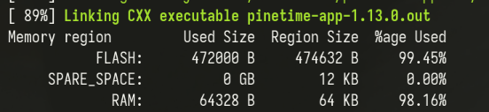

InfiniTime ~~1.13~~ 1.14 on PineTime の通知に日本語が表示されないのが不便なのでどうにかします。

<!--more-->

## フォントを外部フラッシュに入れ… RAMが足りない!
PineTimeには、CPU内蔵の64KB RAMと512KB フラッシュROM、さらにストレージとして4MBのSPI外部フラッシュが搭載されている。512KBしかない内蔵フラッシュの空きには当然日本語の全文字のフォントデータが入らないので、できれば外部フラッシュに逃がしたい。

まずは、[1.11でInfiniTimeが外部フラッシュへのリソースの格納に対応](https://github.com/InfiniTimeOrg/InfiniTime/blob/1.13.0/doc/ExternalResources.md)したので、この方法で日本語フォントを追加しようとした。  
英字+日本語のひらがな+カタカナ+記号+CJK統合漢字のフォントが4MBの外部フラッシュに余裕で収まるサイズ(約787K)に収まったので行けると思いきや、いざフォントを変更する段になって描画前にこの巨大フォントをたった64KBのRAMにロードしないといけないことに気づいた。

漢字数を小学校レベルにまで削っても128KB近くになるので、どうにか直接アクセスできる内蔵フラッシュに押しこむしかない。

## じゃあ文字種を削って内蔵フラッシュに…入らない!
[この記事](https://qiita.com/skyfish20ch/items/e5437221447b4307d299#%E6%97%A5%E6%9C%AC%E8%AA%9E%E5%8C%96)のように内蔵フラッシュにフォントデータを入れようとしてみたが、バージョンアップで元々のフラッシュ使用量が当時より増えたので、フォントを追加すると容量オーバーするようになってしまっていた。

内蔵フラッシュにフォントを入れるとROMが溢れ、外部フラッシュに入れるとRAMが溢れる!

## アプリを削って無理やり押し込む
使わない内蔵アプリ4つ (2048, ポン, お絵描きアプリ, メトロノーム)を削除したらなんとか内蔵フラッシュに収まった。やったね!



2024-01-25 追記: InfiniTime 1.14でフラッシュの使用量が削減され、アプリを消さなくてもフォントが入るようになった

## 結局こうした
1. Noto Sans JPのMediumを `src/displayapp/fonts/` へ投入
2. 元々の英字フォントにNoto Sansのグリフを追加
    ```patch
    --- a/src/displayapp/fonts/fonts.json
    +++ b/src/displayapp/fonts/fonts.json
    @@ -8,6 +8,10 @@
            {
                "file": "FontAwesome5-Solid+Brands+Regular.woff",
                "range": "0xf294, 0xf242, 0xf54b, 0xf21e, 0xf1e6, 0xf017, 0xf129, 0xf03a, 0xf185, 0xf560, 0xf001, 0xf3fd, 0xf1fc, 0xf45d, 0xf59f, 0xf5a0, 0xf027, 0xf028, 0xf6a9, 0xf04b, 0xf04c, 0xf048, 0xf051, 0xf095, 0xf3dd, 0xf04d, 0xf2f2, 0xf024, 0xf252, 0xf569, 0xf06e, 0xf015, 0xf00c"
    +         },
    +         {
    +            "file": "NotoSansJP-Medium.ttf",
    +            "symbols": "一右雨円王音下火花貝学気九休玉金空月犬見五口校左三山子四糸字耳七車手十出女小上森人水正生青夕石赤千川先早草足村大男竹中虫町天田土二日入年白八百文木本名目立力林六引羽雲園遠何科夏家歌画回会海絵外角楽活間丸岩顔汽記帰弓牛魚京強教近兄形計元言原戸古午後語工公広交光考行高黄合谷国黒今才細作算止市矢姉思紙寺自時室社弱首秋週春書少場色食心新親図数西声星晴切雪船線前組走多太体台地池知茶昼長鳥朝直通弟店点電刀冬当東答頭同道読内南肉馬売買麦半番父風分聞米歩母方北毎妹万明鳴毛門夜野友用曜来里理話悪安暗医委意育員院飲運泳駅央横屋温化荷界開階寒感漢館岸起期客究急級宮球去橋業曲局銀区苦具君係軽血決研県庫湖向幸港号根祭皿仕死使始指歯詩次事持式実写者主守取酒受州拾終習集住重宿所暑助昭消商章勝乗植申身神真深進世整昔全相送想息速族他打対待代第題炭短談着注柱丁帳調追定庭笛鉄転都度投豆島湯登等動童農波配倍箱畑発反坂板皮悲美鼻筆氷表秒病品負部服福物平返勉放味命面問役薬由油有遊予羊洋葉陽様落流旅両緑礼列練路和愛案以衣位囲胃印英栄塩億加果貨課芽改械害街各覚完官管関観願希季紀喜旗器機議求泣救給挙漁共協鏡競極訓軍郡径型景芸欠結建健験固功好候航康告差菜最材昨札刷殺察参産散残士氏史司試児治辞失借種周祝順初松笑唱焼象照賞臣信成省清静席積折節説浅戦選然争倉巣束側続卒孫帯隊達単置仲貯兆腸低底停的典伝徒努灯堂働特得毒熱念敗梅博飯飛費必票標不夫付府副粉兵別辺変便包法望牧末満未脈民無約勇要養浴利陸良料量輪類令冷例歴連老労録ー圧移因永営衛易益液演応往桜恩可仮価河過賀快解格確額刊幹慣眼基寄規技義逆久旧居許境均禁句群経潔件券険検限現減故個護効厚耕鉱構興講混査再災妻採際在財罪雑酸賛支志枝師資飼示似識質舎謝授修述術準序招承証条状常情織職制性政勢精製税責績接設舌絶銭祖素総造像増則測属率損退貸態団断築張提程適敵統銅導徳独任燃能破犯判版比肥非備俵評貧布婦富武復複仏編弁保墓報豊防貿暴務夢迷綿輸余預容略留領異遺域宇映延沿我灰拡革閣割株干巻看簡危机揮貴疑吸供胸郷勤筋系敬警劇激穴絹権憲源厳己呼誤后孝皇紅降鋼刻穀骨困砂座済裁策冊蚕至私姿視詞誌磁射捨尺若樹収宗就衆従縦縮熟純処署諸除将傷障城蒸針仁垂推寸盛聖誠宣専泉洗染善奏窓創装層操蔵臓存尊宅担探誕段暖値宙忠著庁頂潮賃痛展討党糖届難乳認納脳派拝背肺俳班晩否批秘腹奮並陛閉片補暮宝訪亡忘棒枚幕密盟模訳郵優幼欲翌乱卵覧裏律臨朗論亜哀挨曖握扱宛嵐依威為畏尉萎偉椅彙違維慰緯壱逸芋咽姻淫陰隠韻唄鬱畝浦詠影鋭疫悦越謁閲炎怨宴援煙猿鉛縁艶汚凹押旺欧殴翁奥憶臆虞乙俺卸穏佳苛架華菓渦嫁暇禍靴寡箇稼蚊牙瓦雅餓介戒怪拐悔皆塊楷潰壊懐諧劾崖涯慨蓋該概骸垣柿核殻郭較隔獲嚇穫岳顎掛括喝渇葛滑褐轄且釜鎌あいうえおかきくけこさしすせそたちつてとなにぬねのはひふへほまみむめもやゆよらりるれろわゐゑをんがぎぐげござじずぜぞだぢづでどばびぶべぼぱぴぷぺぽぁぃぅぇぉっゃゅょアイウエオカキクケコサシスセソタチツテトナニヌネノハヒフヘホマミムメモヤユヨラリルレロワヰヱヲンガギグゲゴザジズゼゾダヂズデドバビブベボパピプペポァィゥェォッャュョヴ、。ー～「」【】『』゛゜♪♭■□◆◇△▲▽▼◎○●◯‥…・∴∵※×〒！”＃＄％＆’（）＝~｜｀｛＋＊｝＜＞？＿－＾＠［；：］，．／＼ａｂｃｄｅｆｇｈｉｊｋｌｍｎｏｐｑｒｓｔｕｖｗｘｙｚＡＢＣＤＥＦＧＨＩＪＫＬＭＮＯＰＱＲＳＴＵＶＷＸＹＺ０１２３４５６７８９"
            }
        ],
        "bpp": 1,
    ```
3. いらないアプリを削除

   2024-01-25 追記: 先述の通り1.14では不要。さらに、cmakeのオプション `-DENABLE_USERAPPS` でインストールするアプリをカスタマイズできるようになったので、削除する場合もパッチは不要になった

    ```patch
    diff --git a/src/CMakeLists.txt b/src/CMakeLists.txt
    index d903629b..8e6e3529 100644
    --- a/src/CMakeLists.txt
    +++ b/src/CMakeLists.txt
    @@ -375,8 +375,8 @@ list(APPEND SOURCE_FILES
            displayapp/screens/Screen.cpp
            displayapp/screens/Clock.cpp
            displayapp/screens/Tile.cpp
    -        displayapp/screens/InfiniPaint.cpp
    -        displayapp/screens/Paddle.cpp
    +        # displayapp/screens/InfiniPaint.cpp
    +        # displayapp/screens/Paddle.cpp
            displayapp/screens/StopWatch.cpp
            displayapp/screens/BatteryIcon.cpp
            displayapp/screens/BleIcon.cpp
    @@ -387,12 +387,12 @@ list(APPEND SOURCE_FILES
            displayapp/screens/Music.cpp
            displayapp/screens/Weather.cpp
            displayapp/screens/Navigation.cpp
    -        displayapp/screens/Metronome.cpp
    +        # displayapp/screens/Metronome.cpp
            displayapp/screens/Motion.cpp
            displayapp/screens/FirmwareValidation.cpp
            displayapp/screens/ApplicationList.cpp
            displayapp/screens/Notifications.cpp
    -        displayapp/screens/Twos.cpp
    +        # displayapp/screens/Twos.cpp
            displayapp/screens/HeartRate.cpp
            displayapp/screens/Motion.cpp
            displayapp/screens/FlashLight.cpp
    diff --git a/src/displayapp/Apps.h b/src/displayapp/Apps.h
    index f253bc03..800e165b 100644
    --- a/src/displayapp/Apps.h
    +++ b/src/displayapp/Apps.h
    @@ -16,13 +16,13 @@ namespace Pinetime {
        FlashLight,
        BatteryInfo,
        Music,
    -      Paint,
    -      Paddle,
    -      Twos,
    +      // Paint,
    +      // Paddle,
    +      // Twos,
        HeartRate,
        Navigation,
        StopWatch,
    -      Metronome,
    +      // Metronome,
        Motion,
        Steps,
        PassKey,
    diff --git a/src/displayapp/DisplayApp.cpp b/src/displayapp/DisplayApp.cpp
    index a930fe96..d3eb4191 100644
    --- a/src/displayapp/DisplayApp.cpp
    +++ b/src/displayapp/DisplayApp.cpp
    @@ -14,16 +14,16 @@
    #include "displayapp/screens/Clock.h"
    #include "displayapp/screens/FirmwareUpdate.h"
    #include "displayapp/screens/FirmwareValidation.h"
    -#include "displayapp/screens/InfiniPaint.h"
    -#include "displayapp/screens/Paddle.h"
    +// #include "displayapp/screens/InfiniPaint.h"
    +// #include "displayapp/screens/Paddle.h"
    #include "displayapp/screens/StopWatch.h"
    -#include "displayapp/screens/Metronome.h"
    +// #include "displayapp/screens/Metronome.h"
    #include "displayapp/screens/Music.h"
    #include "displayapp/screens/Navigation.h"
    #include "displayapp/screens/Notifications.h"
    #include "displayapp/screens/SystemInfo.h"
    #include "displayapp/screens/Tile.h"
    -#include "displayapp/screens/Twos.h"
    +// #include "displayapp/screens/Twos.h"
    #include "displayapp/screens/FlashLight.h"
    #include "displayapp/screens/BatteryInfo.h"
    #include "displayapp/screens/Steps.h"
    @@ -519,15 +519,15 @@ void DisplayApp::LoadScreen(Apps app, DisplayApp::FullRefreshDirections directio
        case Apps::StopWatch:
        currentScreen = std::make_unique<Screens::StopWatch>(*systemTask);
        break;
    -    case Apps::Twos:
    -      currentScreen = std::make_unique<Screens::Twos>();
    -      break;
    -    case Apps::Paint:
    -      currentScreen = std::make_unique<Screens::InfiniPaint>(lvgl, motorController);
    -      break;
    -    case Apps::Paddle:
    -      currentScreen = std::make_unique<Screens::Paddle>(lvgl);
    -      break;
    +    // case Apps::Twos:
    +    //   currentScreen = std::make_unique<Screens::Twos>();
    +    //   break;
    +    // case Apps::Paint:
    +    //   currentScreen = std::make_unique<Screens::InfiniPaint>(lvgl, motorController);
    +    //   break;
    +    // case Apps::Paddle:
    +    //   currentScreen = std::make_unique<Screens::Paddle>(lvgl);
    +    //   break;
        case Apps::Music:
        currentScreen = std::make_unique<Screens::Music>(systemTask->nimble().music());
        break;
    @@ -537,9 +537,9 @@ void DisplayApp::LoadScreen(Apps app, DisplayApp::FullRefreshDirections directio
        case Apps::HeartRate:
        currentScreen = std::make_unique<Screens::HeartRate>(heartRateController, *systemTask);
        break;
    -    case Apps::Metronome:
    -      currentScreen = std::make_unique<Screens::Metronome>(motorController, *systemTask);
    -      break;
    +    // case Apps::Metronome:
    +    //   currentScreen = std::make_unique<Screens::Metronome>(motorController, *systemTask);
    +    //   break;
        /* Weather debug app
        case Apps::Weather:
        currentScreen = std::make_unique<Screens::Weather>(this, systemTask->nimble().weather());
    diff --git a/src/displayapp/screens/ApplicationList.h b/src/displayapp/screens/ApplicationList.h
    index 7bdd1154..d3a36960 100644
    --- a/src/displayapp/screens/ApplicationList.h
    +++ b/src/displayapp/screens/ApplicationList.h
    @@ -47,10 +47,10 @@ namespace Pinetime {
            {Symbols::heartBeat, Apps::HeartRate},
            {Symbols::music, Apps::Music},

    -          {Symbols::paintbrush, Apps::Paint},
    -          {Symbols::paddle, Apps::Paddle},
    -          {"2", Apps::Twos},
    -          {Symbols::drum, Apps::Metronome},
    +          // {Symbols::paintbrush, Apps::Paint},
    +          // {Symbols::paddle, Apps::Paddle},
    +          // {"2", Apps::Twos},
    +          // {Symbols::drum, Apps::Metronome},
            {Symbols::map, Apps::Navigation},
            {Symbols::none, Apps::None},
    ```

## OTA インストール
2024-01-25 追記: [依存ライブラリにパッチを当てないと](https://gitea.elara.ws/Elara6331/itd/issues/66)itdが動かなくなってた

```shell
InfiniTime/build $ nix shell nixpkgs#itd
InfiniTime/build $ itd &
InfiniTime/build $ itctl firmware upgrade --archive src/pinetime-mcuboot-app-dfu-*.zip --resources src/resources/infinitime-resources-*.zip
```

## できあがり
開発キットを持っていることを忘れていきなり実機にインストールしてしまったけど、無事うまく行った。



## おまけ
### バイナリ
ビルドしたバイナリを *[ここ](https://github.com/ngkz/InfiniTime-Japanese/releases)* に置いておきました。よかったら使ってください

### NixでInfiniTimeをビルドするには
https://github.com/ngkz/InfiniTime-Japanese/commit/12e17adc34e162c1b835e2a56f4798ccb8e653ca を当てて

#### デバッグビルド
```shell
infinitime $ direnv allow . # OR nix develop
infinitime $ mkdir build && cd build
infinitime/build $ do_cmake -DBUILD_DFU=1 -DBUILD_RESOURCES=1 ..
infinitime/build $ make -j$(nproc)
```

#### リリースビルド
```shell
infinitime $ nix build .?submodules=1#
```

## 参考
 * [PineTimeをいじってみる#日本語化](https://qiita.com/skyfish20ch/items/e5437221447b4307d299#%E6%97%A5%E6%9C%AC%E8%AA%9E%E5%8C%96)

   大変参考になりました。ありがとうございます。
